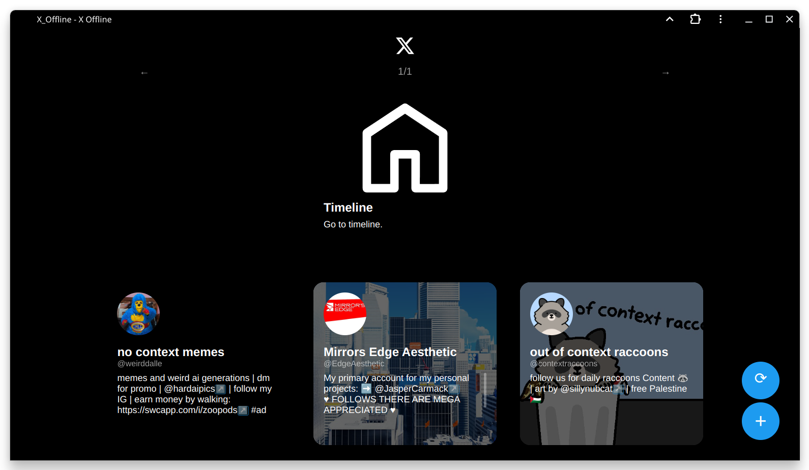
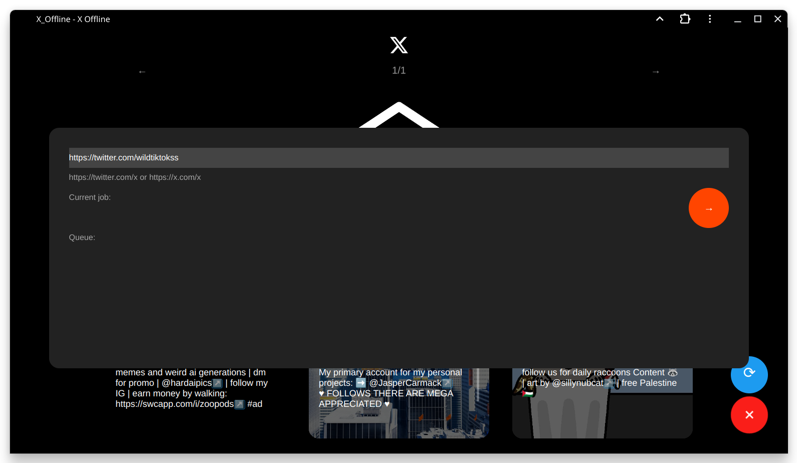
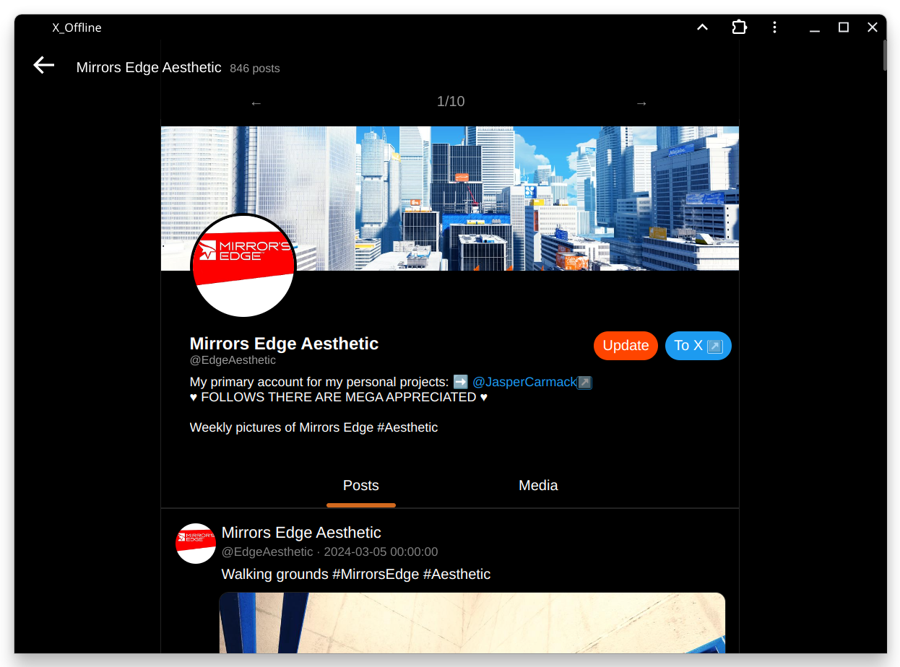
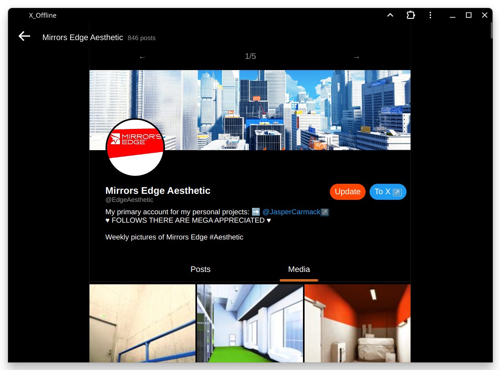
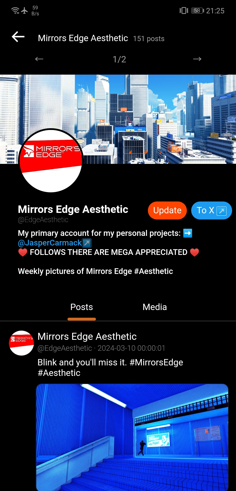

# X_offline
Download and view twitter/X content locally.

WIP, not ready yet.








### Requirement 
- Python lib `flask`,`gallery-dl`

- `cookies.txt` from twitter/X, try [get-cookiestxt-locally](https://chromewebstore.google.com/detail/get-cookiestxt-locally/cclelndahbckbenkjhflpdbgdldlbecc).

- `ffmpeg` (optional)

### Configure

Edit `config.py`.

### Run
```
python3 server.py
```