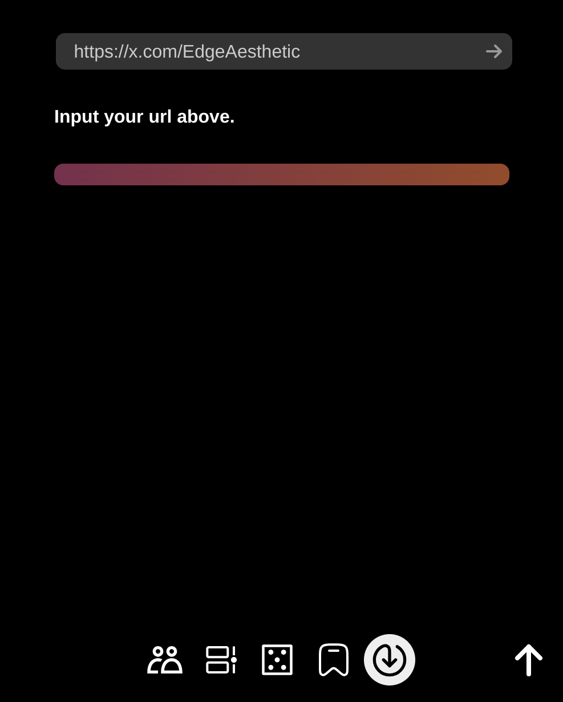
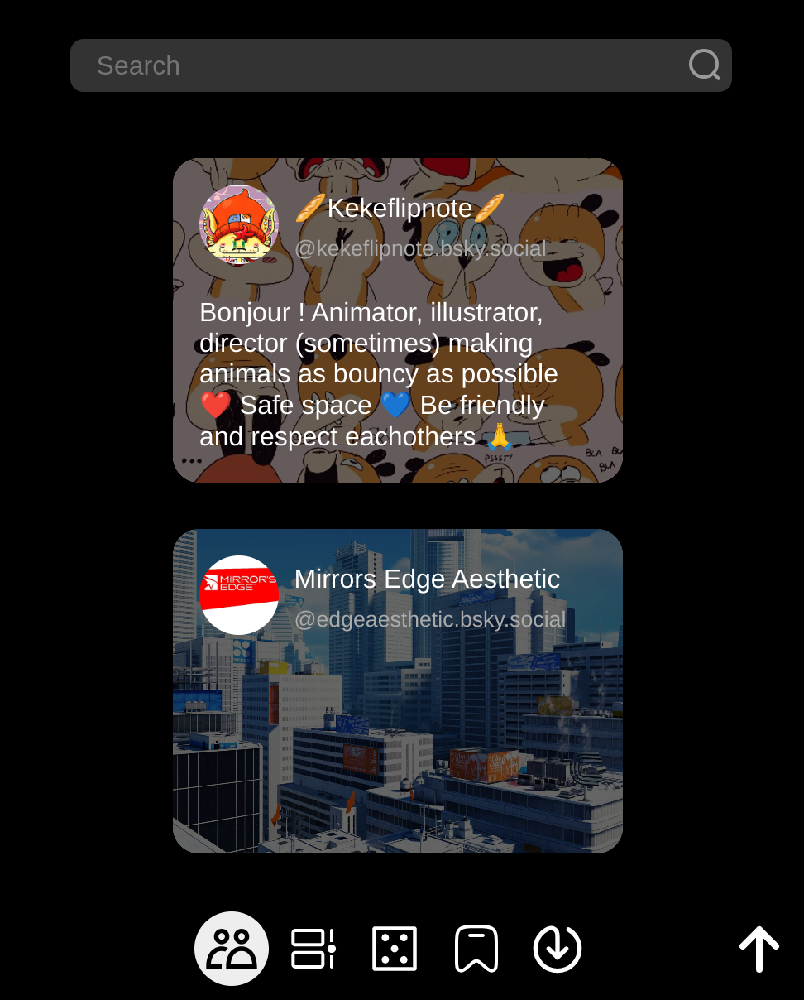
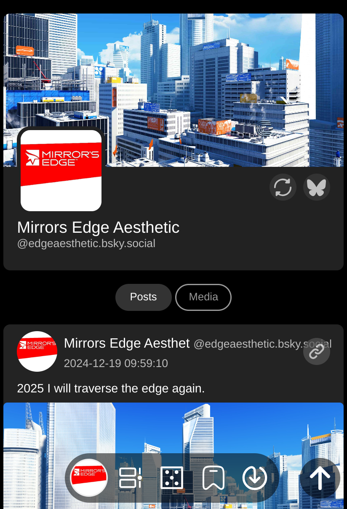

# X_offline
Download and view twitter/X and bluesky content locally.

WIP, not ready yet.





### Requirement 
- Python lib `flask`,`gallery-dl`,`natsort`

- `cookies.txt` from twitter/X if possible, try [get-cookiestxt-locally](https://chromewebstore.google.com/detail/get-cookiestxt-locally/cclelndahbckbenkjhflpdbgdldlbecc).

- `ffmpeg` (optional)

### Configure

Edit `config.py`.

### Run
```
python3 app.py
```